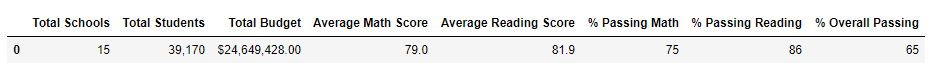
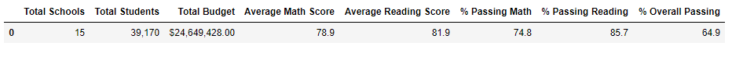
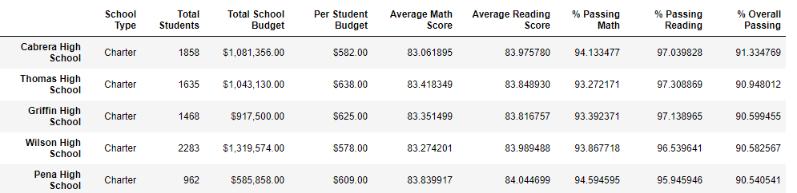
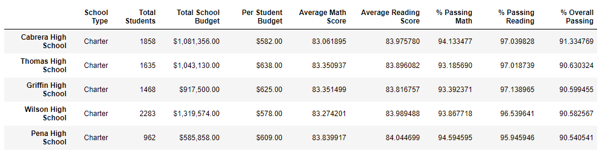
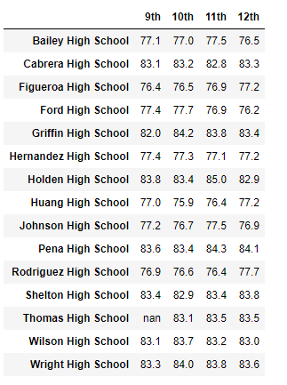
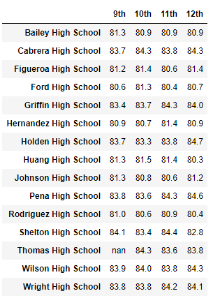
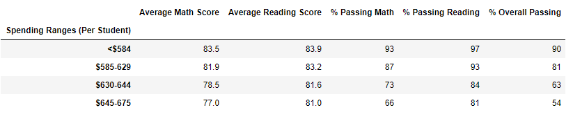
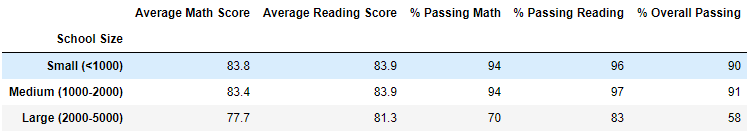
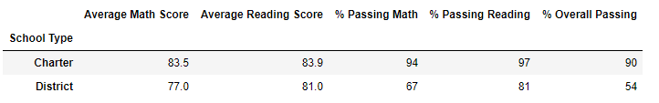

# PyCity Schools with Pandas

## Overview 

The purpose of this analysis is to provide Maria different arrays of data from the complete school and complete students list she provided. The following arrays will provide a district summary, a school summary, the top five schools, bottom five schools, results by grade in reading and math, a spending summary, a size summary and a type summary. After completing the full code, I also had to account for the 9th grade scores from Thomas High School being altered. This would disqualify their scores from being listed in the complete analysis and would cause some slight changes from the original code and the new code.

## Results

### Original
	

### New
	

- The district summary overall changed very slightly from the original. Average Math Scores, Percentage of students passing Math and Reading and Overall Passing percentages went down slightly. All other data was unaffected.

### Original
	

### New
	

- The school summary wasn't affected much at all. Thomas High School's scores varied slightly from the original code especially since we only accounted for 10th - 12th grade scores

- As we can see from the above images, Thomas High School still sits among the top five schools in the district. Removing the ninth grade scores slightly reduced their scores overall.

### Math and Reading By Grade
		

As far as further effects of removing the ninth grade scores:

- By looking at each individual grade Thomas High School cannot be judged the same way as other schools since their scores are null. While Thomas High School 9th graders originally had 83.1 in Math and 83.7 in Reading scores, we will have wait until the following year to see if the scores are not altered again. Math overall tends to be worse performing subject when compared to Reading.

	

- As for scores based on spending per student, there was no effect in removing the ninth grade scores. There appears to be a negative relationship between higher budget resulting in lower test performance.

	

- Scores based on the size of the schools were also not affected by removing the ninth grade scores. There is a negative relationship between larger schools resulting in lower test performance.

	

- Lastly, the scores based on the type of school were not affected by the removal of ninth grade scores. Charter schools predominantly outperform district schools in every category.

## Summary

All in all, the school district analysis went through a few slight changes after removing the ninth grade scores. 
1. The average scores of Math and Reading were slightly lower
2. The individual passing percentages for Math and Reading as well as Overall Passing percentage were slightly lower
3. Thomas High School's performance in all catgeories were slightly lower 
4. Thomas High School will be under more scrutiny as well as all other Charter schools due to Charter schools being performance driven and if one school altered their scores, there may be more doing the same thing.
 

